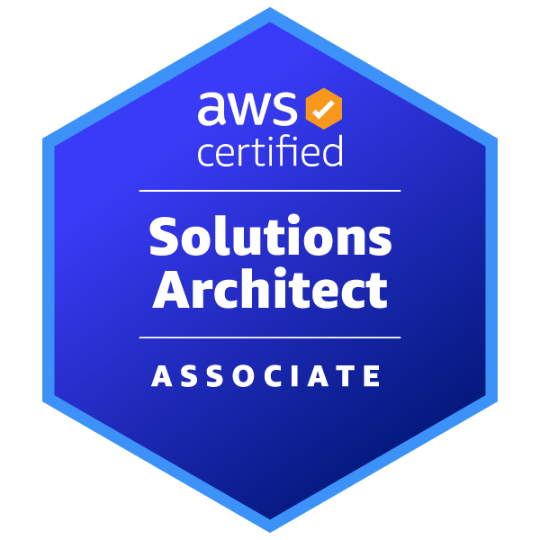
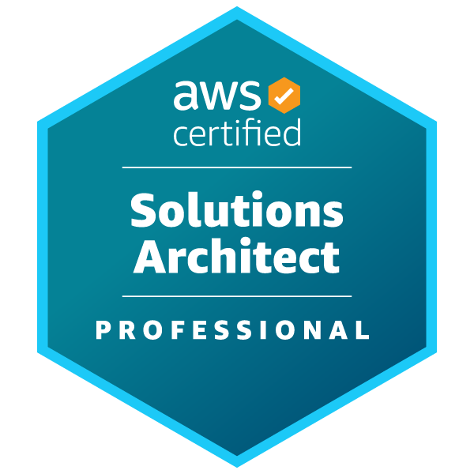

Profile

  
## Profile

I like front-end development and 3DCG modeling.

 
  

Languages and Tools

## Languages and Tools:

## NOW TRAINING

Qiita & Zenn

## Qiita & Zenn

  
  
  
  

Certifications

  
## AWS Certifications

  
  

