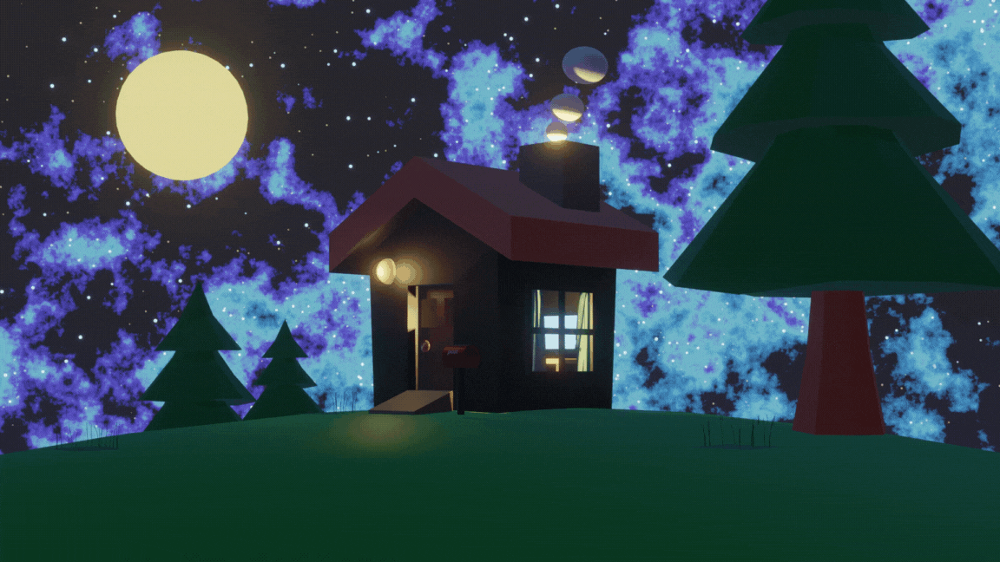

  

Created by enumura in Blender

## ■ Profile
### I like front-end development and 3DCG modeling.

 
  

    

## ■ Languages and Tools:

         <a href="https://git-scm.com/" target="_blank" rel="noreferrer">  

## ■NOW TRAINING

 

## ■ Social & Posts
### ・ Social

### ・ Qiita

### ・ Zenn

